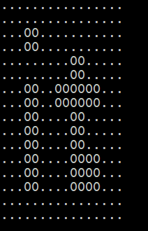

# Image-output
Создание библиотечного архива и использование внешних библиотек JCommander и JCDP.

## Introduction
- Для написания программ использовалась версия Java 8.
- Отладка кода воспроизводилась на Intellij IDEA CE.
- Правила форматирования кода соответствуют общепринятым стандартам [Oracle](https://www.oracle.com/java/technologies/javase/codeconventions-namingconventions.html).

## Contents
1. [Exercise 00](#exercise-00)
2. [Exercise 01](#exercise-01)
3. [Exercise 02](#exercise-02)

### Exercise 00

- Программа расположена в директории: ex00;
- Типы(+ все методы этого типа): File, ImageIO, BufferedImage;
- Корневая папка проекта: ImagesToChar.

Реализован функционал, выводящий в консоль двухцветное изображение.

Пример черно-белого изображения в формате BMP (данный формат обязателен для запуска программы). Размер изображения 16*16 пикселей.

Вы можете скачать это изображение [здесь](https://yadi.sk/i/nt-C_kZKWrlyNQ ).

Приложение принимает входные параметры, соответствующие символам, которые должны отображаться вместо белых и черных пикселей, и полный путь к изображению на вашем диске.

Если "." символ используется для белого цвета и «0» для черного, изображение в консоли может выглядеть следующим образом:

Проект имеет следующую структуру:

- ImagesToChar - project folder
  - src - source files
    -	java - files of Java source code
        - edu.school21.printer - a series of main packages
          -	app - a package that contains classes for startup 
          -	logic - a package that contains the logic for converting an image into an array of characters
  -	target - compiled .class files
    -	edu.school21.printer ...
  -	README.txt
  
Файл README.txt содержит инструкцию по компиляции и запуску исходного кода из консоли (не IDE). Инструкция написана для состояния, когда консоль открыта в корневой папке проекта.

### Exercise 01

- Программа расположена в директории: ex01;
- Типы(+ все методы этого типа): File, ImageIO, BufferedImage;
- Корневая папка проекта: ImagesToChar.

В этом проекте создан дистрибутив приложения — JAR-архив. Изображение содержится в этом архиве, следовательно, в этой задаче параметр командной строки для указания полного пути к файлу не требуется.

Проект имеет следующую структуру:

- ImagesToChar - project folder
  - src - source files
    - java - files of Java source code
      - ...
    -	resources - a folder with resource files
         - image.bmp - the displayed image
    - manifest.txt - a file containing the description of the initial point for archive startup  
  - target - compiled .class files and archive
    - edu.school21.printer ...
    - resources
    - images-to-chars-printer.jar
  - README.txt

Архив и все скомпилированные файлы при сборке помещаются в target папку.

Файл README.txt содержит информацию о сборке и запуске архива.

### Exercise 02

- Программа расположена в директории: ex02;
- Использованные библиотеки: JCommander, JCDP;
- Типы(+ все методы этого типа): Parameter, Parameters, ColoredPrinter, Ansi, File, ImageIO, BufferedImage;
- Корневая папка проекта: ImagesToChar.

Архивы с внешними библиотеками скачиваются и включаются в проект предыдущей задачи.

Теперь параметры запуска приложения будут обрабатываться средствами JCommander. Изображение отображается с использованием опции «цветного» вывода библиотеки JCDP.

Проект имеет следующую структуру:

- ImagesToChar - project folder
  -	lib - external library folder
    -	jcommander-*.**.jar
    -	JCDP-*.*.*.jar/JCOLOR-*.*.*.jar
  -	src - source files
  -	target - compiled .class files and archive
    -	edu.school21.printer
    -	com/beust ... - .class files of JCommander library
    -	com/diogonunes ... - .class files of JCDP library
    -	resources
    -	images-to-chars-printer.jar
  -	README.txt

Файл README.txt содержит информацию о включении внешних библиотек в финальную сборку.

Пример работы программы:

`$ java -jar images-to-chars-printer.jar --white=RED --black=GREEN`

